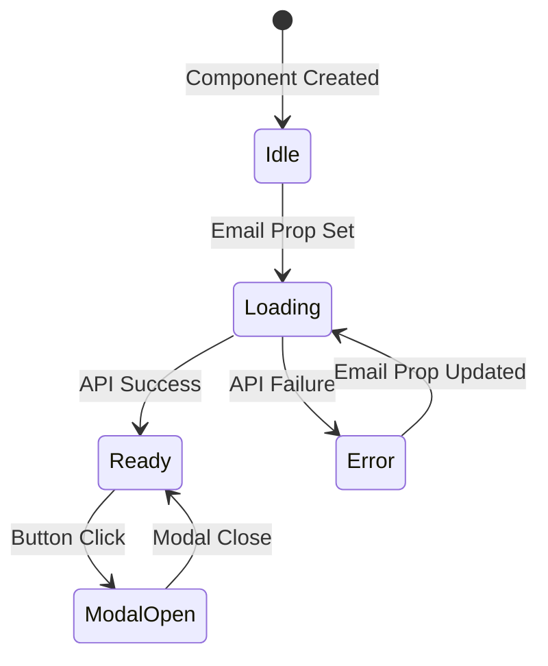

# Operator Underwriting Web Component - Architecture Plan

## Executive Summary

This document outlines the architecture for the `<operator-underwriting>` web component. The component provides a button that opens a blank modal for underwriting operations. It validates the operator email by calling the `getAccountByEmail` API and manages the button state based on the API response.

---

## Component Overview

### Purpose

The `operator-underwriting` component allows users to initiate underwriting processes for operators. It:

1. Accepts an operator email as a prop
2. Validates the email against the API when the prop is set
3. Stores the Moov account ID on successful validation
4. Disables the button with a broken link icon on failure
5. Opens a blank modal when the button is clicked

### Usage Example

```html
<script type="module" src="component.js"></script>

<operator-underwriting
  operator-email="operator@example.com"
  api-base-url="https://api.example.com"
  embeddable-key="your-key-here">
</operator-underwriting>

<script>
  const underwriting = document.querySelector("operator-underwriting");

  underwriting.addEventListener("underwriting-ready", (e) => {
    console.log("Account validated:", e.detail.moovAccountId);
  });

  underwriting.addEventListener("underwriting-error", (e) => {
    console.error("Validation failed:", e.detail.error);
  });
</script>
```

---

## Architecture Design

### Component Flow Diagram



### State Management

```javascript
_state = {
  // Operator email from prop
  operatorEmail: null,

  // Moov account ID from API response
  moovAccountId: null,

  // UI States
  isLoading: false,
  isError: false,
  isModalOpen: false,

  // Error details
  error: null,
};
```

### Component Lifecycle

1. **Constructor**: Initialize Shadow DOM, set up initial state
2. **connectedCallback**: Read initial attributes, trigger API call if email is set
3. **attributeChangedCallback**: Handle attribute changes, trigger API call when email changes
4. **disconnectedCallback**: Clean up event listeners

---

## API Integration

### getAccountByEmail Call

The component uses the existing [`BisonJibPayAPI.getAccountByEmail()`](api.js:98) method:

```javascript
async initializeAccount() {
  if (!this._state.operatorEmail) return;

  this._state.isLoading = true;
  this._state.isError = false;
  this.updateButtonState();

  try {
    const response = await this.api.getAccountByEmail(this._state.operatorEmail);

    // Success: Store moov account ID
    this._state.moovAccountId = response.data.moovAccountId;
    this._state.isLoading = false;

    // Emit success event
    this.dispatchEvent(new CustomEvent('underwriting-ready', {
      detail: { moovAccountId: this._state.moovAccountId },
      bubbles: true,
      composed: true
    }));

  } catch (error) {
    // Failure: Set error state
    this._state.isError = true;
    this._state.isLoading = false;
    this._state.error = error.message || 'Failed to validate operator';

    // Emit error event
    this.dispatchEvent(new CustomEvent('underwriting-error', {
      detail: { error: this._state.error, originalError: error },
      bubbles: true,
      composed: true
    }));
  }

  this.updateButtonState();
}
```

---

## UI Components

### Button States

| State       | Appearance                        | Behavior                |
| ----------- | --------------------------------- | ----------------------- |
| **Loading** | Gray background, spinner icon     | Disabled, shows loading |
| **Ready**   | Primary color, enabled            | Clickable, opens modal  |
| **Error**   | Gray background, broken link icon | Disabled, shows tooltip |

### Button Rendering

```html
<!-- Ready State -->
<button class="underwriting-btn">Start Underwriting</button>

<!-- Loading State -->
<button class="underwriting-btn loading" disabled>
  <span class="loading-spinner"></span>
  Start Underwriting
</button>

<!-- Error State -->
<button class="underwriting-btn error" disabled>
  <svg class="broken-link-icon">...</svg>
  Start Underwriting
</button>
```

### Modal Structure

```html
<div class="modal">
  <div class="modal-overlay"></div>
  <div class="modal-content">
    <button class="close-btn">×</button>
    <!-- Blank content area for future use -->
  </div>
</div>
```

---

## CSS Styling

The component follows the same styling patterns as [`OperatorPayment`](operator-payment.js:916):

```css
:host {
  display: inline-block;
}

.underwriting-btn {
  padding: 12px 24px;
  background: #325240;
  color: white;
  border: none;
  border-radius: 12px;
  font-size: 14px;
  font-weight: 500;
  cursor: pointer;
  transition: all 0.3s ease;
  display: inline-flex;
  align-items: center;
  gap: 8px;
}

.underwriting-btn:hover:not(.error):not(.loading) {
  background: #2a4536;
}

.underwriting-btn.error {
  background: #9ca3af;
  cursor: not-allowed;
}

.underwriting-btn.loading {
  background: #6b8f7a;
  cursor: wait;
}
```

---

## Events

### Custom Events Emitted

| Event                      | Trigger           | Detail                                     |
| -------------------------- | ----------------- | ------------------------------------------ |
| `underwriting-ready`       | API call succeeds | `{ moovAccountId: string }`                |
| `underwriting-error`       | API call fails    | `{ error: string, originalError: object }` |
| `underwriting-modal-open`  | Modal opens       | `{ moovAccountId: string }`                |
| `underwriting-modal-close` | Modal closes      | `{ moovAccountId: string }`                |

---

## Properties and Attributes

### Observed Attributes

| Attribute        | Type   | Default         | Description                    |
| ---------------- | ------ | --------------- | ------------------------------ |
| `operator-email` | String | null            | The operator email to validate |
| `api-base-url`   | String | Development URL | Base URL for API calls         |
| `embeddable-key` | String | Default key     | API authentication key         |

### JavaScript Properties

| Property        | Type    | Description                          |
| --------------- | ------- | ------------------------------------ |
| `operatorEmail` | String  | Get/set operator email               |
| `moovAccountId` | String  | Read-only, returns stored account ID |
| `isReady`       | Boolean | Read-only, true if account validated |

---

## File Structure

```
web-components/
├── api.js                          # Existing API class
├── component.js                    # Barrel export (needs update)
├── operator-underwriting.js        # NEW: Underwriting component
├── operator-underwriting-demo.html # NEW: Demo page
├── operator-payment.js             # Reference component
└── ...
```

---

## Implementation Steps

1. **Create `operator-underwriting.js`**

   - Define `OperatorUnderwriting` class extending `HTMLElement`
   - Implement Shadow DOM with styles
   - Implement state management
   - Implement API integration
   - Implement button and modal UI
   - Register custom element

2. **Update `component.js`**

   - Add import for `operator-underwriting.js`

3. **Create demo page**
   - Create `operator-underwriting-demo.html` for testing

---

## Code Structure

```javascript
class OperatorUnderwriting extends HTMLElement {
  constructor() {
    /* Initialize Shadow DOM, state, API */
  }

  // Static Properties
  static get observedAttributes() {
    /* Return watched attributes */
  }

  // Lifecycle
  connectedCallback() {
    /* Setup when added to DOM */
  }
  disconnectedCallback() {
    /* Cleanup when removed */
  }
  attributeChangedCallback() {
    /* Handle attribute changes */
  }

  // Properties
  get operatorEmail() {
    /* Return email from state */
  }
  set operatorEmail(value) {
    /* Update email, trigger API call */
  }
  get moovAccountId() {
    /* Return account ID */
  }
  get isReady() {
    /* Return ready state */
  }

  // API Integration
  async initializeAccount() {
    /* Call API, update state */
  }

  // UI Methods
  updateButtonState() {
    /* Update button appearance */
  }
  openModal() {
    /* Show modal */
  }
  closeModal() {
    /* Hide modal */
  }

  // Event Handling
  setupEventListeners() {
    /* Attach listeners */
  }
  removeEventListeners() {
    /* Detach listeners */
  }

  // Rendering
  render() {
    /* Render component */
  }
  renderStyles() {
    /* Return CSS */
  }
}

customElements.define("operator-underwriting", OperatorUnderwriting);
```

---

## Testing Checklist

- [ ] Component renders correctly with no props
- [ ] Button shows loading state when email is set
- [ ] Button becomes active after successful API call
- [ ] Button shows disabled state with broken link icon on API failure
- [ ] Modal opens when button is clicked in ready state
- [ ] Modal closes with close button or overlay click
- [ ] ESC key closes modal
- [ ] Events are emitted correctly
- [ ] Component works with dynamically changed email prop
- [ ] Tooltip shows on disabled button hover

---

## Dependencies

- **BisonJibPayAPI** from [`api.js`](api.js) - Required for API calls
- No external dependencies required

---

**Document Version:** 1.0  
**Created:** 2025-11-27  
**Author:** Architecture Team
