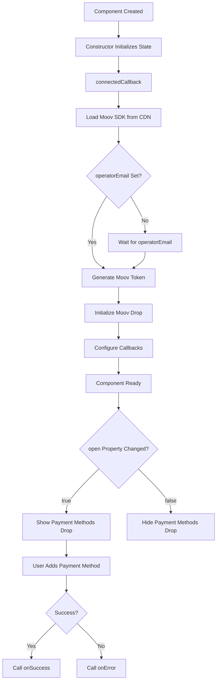

# OperatorPayment Web Component - Architecture Design

## Executive Summary

This document outlines the architecture for the **OperatorPayment** web component - a lightweight wrapper around Moov's payment methods drop that simplifies operator payment integration. The component provides a clean API for managing payment methods with operator-specific context.

---

## Table of Contents

1. [Analysis of mock-component.tsx](#analysis-of-mock-componenttsx)
2. [Component Overview](#component-overview)
3. [Architecture Design](#architecture-design)
4. [API Specification](#api-specification)
5. [State Management](#state-management)
6. [Integration with Moov Drop](#integration-with-moov-drop)
7. [Mock Implementation Details](#mock-implementation-details)
8. [Usage Examples](#usage-examples)
9. [Implementation Roadmap](#implementation-roadmap)
10. [Developer Guidelines](#developer-guidelines)

---

## Analysis of mock-component.tsx

### Key Patterns Identified

From [`mock-component.tsx`](mock-component.tsx:1-69), we've identified the following implementation patterns:

**1. Token Generation Pattern (Line 17-23)**
```typescript
const { generateMoovToken } = useMoovMethods();

generateMoovToken(selectedAccount).then((result) => {
  Moov.token = result.access_token;
  Moov.accountID = selectedAccount;
});
```

**2. Moov Drop Configuration (Line 24-36)**
```typescript
Moov.onResourceCreated = (result) => {
  console.log("BANK ACCOUNT SUCCESSFULLY ADDED", result);
};
Moov.microDeposits = false;
Moov.onError = ({ errorType, error }) => {
  console.log(errorType);
  console.error(error);
};
```

**3. Open Control (Line 43-47)**
```typescript
const openInterface = () => {
  if (moovRef.current) {
    moovRef.current.open = true;
  }
};
```

**4. Component Structure (Line 66)**
```tsx
<moov-payment-methods ref={moovRef} />
```

### Key Findings

- **Separation of Concerns**: Token generation is separate from UI rendering
- **Async Operations**: Token generation is asynchronous
- **Event-Driven**: Uses callbacks for success and error handling
- **Imperative API**: The drop is controlled via `open` property
- **Account-Based**: Tied to a specific account/email identifier

---

## Component Overview

### Purpose

The **OperatorPayment** web component serves as a streamlined interface for operators to add payment methods through Moov's payment-methods drop, with built-in token management and error handling.

### Key Features

✅ **Simple API**: Clean property-based interface
✅ **Auto-CDN Loading**: Automatically loads Moov SDK from CDN
✅ **Mock Token Generation**: Internal mock implementation for development
✅ **Callback Support**: Both `onSuccess` and `onError` handlers
✅ **Visibility Control**: `open` property for drop state management
✅ **Operator-Centric**: Uses operator email instead of generic account ID
✅ **Zero UI**: Pure wrapper component without additional UI elements
✅ **Framework Agnostic**: Vanilla JavaScript web component

### Design Principles

1. **Simplicity**: Minimal API surface, easy to understand
2. **Flexibility**: Developers implement real token generation
3. **Consistency**: Follows existing component patterns in the project
4. **Encapsulation**: Internal state management via Shadow DOM
5. **Extensibility**: Easy to customize and extend

---

## Architecture Design

### Component Structure

```
OperatorPayment (Web Component)
├── Shadow Root
│   └── <moov-payment-methods />
├── Properties
│   ├── operatorEmail (string)
│   ├── onSuccess (function)
│   ├── onError (function)
│   └── open (boolean)
├── Internal State
│   ├── moovToken (string)
│   ├── isInitialized (boolean)
│   └── moovRef (element reference)
└── Methods
    ├── ensureMoovSDK()
    ├── generateMoovToken() [mock]
    ├── initializeMoovDrop()
    └── handleError()
```

### Component Lifecycle



---

## API Specification

### Properties

#### `operatorEmail` (required)
- **Type**: `string`
- **Description**: Operator's email address used to generate Moov token and identify the account
- **Example**: `"operator@example.com"`
- **Behavior**: When set, triggers token generation and Moov drop initialization

#### `onSuccess` (optional)
- **Type**: `function(resourceData)`
- **Description**: Callback invoked when payment method is successfully added
- **Parameters**:
  - `resourceData`: Object containing the created payment method details
- **Example**:
  ```javascript
  component.onSuccess = (data) => {
    console.log('Payment method added:', data);
    // Close modal, refresh list, etc.
  };
  ```

#### `onError` (optional)
- **Type**: `function({ errorType, error })`
- **Description**: Callback invoked when an error occurs
- **Parameters**:
  - `errorType`: String indicating error category (e.g., "bankAccount", "plaid", "token")
  - `error`: Error message or object
- **Example**:
  ```javascript
  component.onError = ({ errorType, error }) => {
    console.error(`${errorType} error:`, error);
    // Show error message to user
  };
  ```

#### `open` (optional)
- **Type**: `boolean`
- **Default**: `false`
- **Description**: Controls visibility of the Moov payment methods drop
- **Example**:
  ```javascript
  // Show the drop
  component.open = true;
  
  // Hide the drop
  component.open = false;
  ```

### Attributes

The component supports attribute-based configuration for HTML usage:

```html
<operator-payment 
  operator-email="operator@example.com"
  on-success="handlePaymentSuccess"
  on-error="handlePaymentError"
  open>
</operator-payment>
```

### Methods

#### `generateMoovToken(operatorEmail)` (internal, mocked)
- **Description**: Generates a mock Moov access token for the operator
- **Returns**: `Promise<{ access_token: string }>`
- **Note**: Developers should replace this with actual API call

---

## State Management

### Internal State Structure

```javascript
class OperatorPayment extends HTMLElement {
  constructor() {
    super();
    
    // Internal state
    this._state = {
      operatorEmail: null,
      moovToken: null,
      isInitialized: false,
      isLoading: false,
      error: null
    };
    
    // Callback references
    this._onSuccessCallback = null;
    this._onErrorCallback = null;
    
    // Moov drop reference
    this._moovRef = null;
  }
}
```

### State Update Pattern

```javascript
// State updates trigger re-initialization if needed
set operatorEmail(value) {
  if (this._state.operatorEmail !== value) {
    this._state.operatorEmail = value;
    this._state.isInitialized = false;
    
    // Reinitialize if already connected
    if (this.isConnected && value) {
      this.initializeMoovDrop();
    }
  }
}
```

---

## Integration with Moov Drop

### SDK Loading

The component automatically loads the Moov SDK from the CDN (`https://js.moov.io/v1/moov.js`) when needed:

```javascript
async ensureMoovSDK() {
  // Check if Moov is already loaded
  if (window.Moov) {
    return Promise.resolve();
  }

  // Check if script is already being loaded
  const existingScript = document.querySelector('script[src*="moov.js"]');
  if (existingScript) {
    return new Promise((resolve, reject) => {
      existingScript.addEventListener('load', () => resolve());
      existingScript.addEventListener('error', () =>
        reject(new Error('Failed to load Moov SDK'))
      );
    });
  }

  // Load the SDK
  return new Promise((resolve, reject) => {
    const script = document.createElement('script');
    script.src = 'https://js.moov.io/v1/moov.js';
    script.async = true;
    script.defer = true;

    script.onload = () => resolve();
    script.onerror = () => {
      const error = new Error('Failed to load Moov SDK from CDN');
      this.handleError({
        errorType: 'sdk',
        error: error.message
      });
      reject(error);
    };

    document.head.appendChild(script);
  });
}
```

### Initialization Flow

```javascript
async initializeMoovDrop() {
  // 1. Validate prerequisites
  if (!this._state.operatorEmail) {
    console.warn('OperatorPayment: operatorEmail is required');
    return;
  }
  
  if (!window.Moov) {
    this.handleError({
      errorType: 'sdk',
      error: 'Moov SDK not loaded. Please include the Moov SDK script.'
    });
    return;
  }
  
  // 2. Generate token (mocked)
  try {
    this._state.isLoading = true;
    const tokenResult = await this.generateMoovToken(this._state.operatorEmail);
    this._state.moovToken = tokenResult.access_token;
  } catch (error) {
    this.handleError({ errorType: 'token', error });
    return;
  } finally {
    this._state.isLoading = false;
  }
  
  // 3. Get reference to moov-payment-methods element
  this._moovRef = this.shadowRoot.querySelector('moov-payment-methods');
  
  if (!this._moovRef) {
    console.error('OperatorPayment: moov-payment-methods element not found');
    return;
  }
  
  // 4. Configure the Moov drop
  this._moovRef.token = this._state.moovToken;
  this._moovRef.accountID = this._state.operatorEmail;
  this._moovRef.microDeposits = false;
  
  // 5. Set up callbacks
  this._moovRef.onResourceCreated = (result) => {
    console.log('OperatorPayment: Payment method added', result);
    
    if (this._onSuccessCallback) {
      this._onSuccessCallback(result);
    }
    
    // Auto-close after success
    this.open = false;
  };
  
  this._moovRef.onError = ({ errorType, error }) => {
    console.error('OperatorPayment: Moov error', errorType, error);
    this.handleError({ errorType, error });
  };
  
  // 6. Mark as initialized
  this._state.isInitialized = true;
}
```

### Open State Management

```javascript
get open() {
  return this._moovRef?.open || false;
}

set open(value) {
  const shouldOpen = Boolean(value);
  
  // Initialize if not yet initialized
  if (!this._state.isInitialized && shouldOpen) {
    this.initializeMoovDrop().then(() => {
      if (this._moovRef) {
        this._moovRef.open = shouldOpen;
      }
    });
  } else if (this._moovRef) {
    this._moovRef.open = shouldOpen;
  }
}
```

---

## Mock Implementation Details

### Token Generation (Mock)

```javascript
/**
 * MOCK IMPLEMENTATION - Replace with actual API call
 * 
 * Generates a mock Moov access token for the operator.
 * 
 * In production, this should:
 * 1. Make authenticated request to your backend
 * 2. Backend calls Moov API to generate token
 * 3. Return the token to frontend
 * 
 * @param {string} operatorEmail - Operator's email address
 * @returns {Promise<{access_token: string}>}
 */
async generateMoovToken(operatorEmail) {
  console.log(`[MOCK] Generating Moov token for: ${operatorEmail}`);
  
  // Simulate API delay
  await new Promise(resolve => setTimeout(resolve, 500));
  
  // Generate mock token (in real app, this comes from your backend)
  const mockToken = `mock_token_${Date.now()}_${Math.random().toString(36).substr(2, 9)}`;
  
  console.log('[MOCK] Token generated:', mockToken);
  
  return {
    access_token: mockToken,
    // Optional: include additional mock data
    expires_in: 3600,
    scope: 'accounts.write payment_methods.write'
  };
}
```

### Developer TODO Comments

```javascript
// TODO: Replace this mock implementation with actual API call
// Example implementation:
/*
async generateMoovToken(operatorEmail) {
  const response = await fetch('/api/moov/generate-token', {
    method: 'POST',
    headers: {
      'Content-Type': 'application/json',
      'Authorization': `Bearer ${yourAuthToken}`
    },
    body: JSON.stringify({ operatorEmail })
  });
  
  if (!response.ok) {
    throw new Error('Failed to generate Moov token');
  }
  
  return await response.json();
}
*/
```

---

## Usage Examples

### Example 1: Basic Usage

```html
<!DOCTYPE html>
<html>
<head>
  <!-- Moov SDK is automatically loaded by the component -->
  <script src="payments-operator.js"></script>
</head>
<body>
  <button id="addPaymentBtn">Add Payment Method</button>
  
  <operator-payment id="paymentComponent"></operator-payment>
  
  <script>
    const paymentComponent = document.getElementById('paymentComponent');
    const addPaymentBtn = document.getElementById('addPaymentBtn');
    
    // Set operator email
    paymentComponent.operatorEmail = 'operator@example.com';
    
    // Set success callback
    paymentComponent.onSuccess = (data) => {
      console.log('Payment method added:', data);
      alert('Payment method added successfully!');
    };
    
    // Set error callback
    paymentComponent.onError = ({ errorType, error }) => {
      console.error(`Error (${errorType}):`, error);
      alert(`Failed to add payment method: ${error}`);
    };
    
    // Open the payment drop on button click
    addPaymentBtn.addEventListener('click', () => {
      paymentComponent.open = true;
    });
  </script>
</body>
</html>
```

### Example 2: React Integration

```jsx
import { useRef, useEffect } from 'react';

function PaymentModal({ operatorEmail, isOpen, onClose }) {
  const paymentRef = useRef(null);
  
  useEffect(() => {
    if (paymentRef.current) {
      // Set operator email
      paymentRef.current.operatorEmail = operatorEmail;
      
      // Set callbacks
      paymentRef.current.onSuccess = (data) => {
        console.log('Payment method added:', data);
        onClose(true); // Close modal with success
      };
      
      paymentRef.current.onError = ({ errorType, error }) => {
        console.error('Payment error:', errorType, error);
        alert(`Error: ${error}`);
      };
    }
  }, [operatorEmail, onClose]);
  
  useEffect(() => {
    if (paymentRef.current) {
      paymentRef.current.open = isOpen;
    }
  }, [isOpen]);
  
  return (
    <div className={`modal ${isOpen ? 'visible' : ''}`}>
      <div className="modal-content">
        <button onClick={() => onClose(false)}>Close</button>
        <operator-payment ref={paymentRef}></operator-payment>
      </div>
    </div>
  );
}
```

### Example 3: Vue Integration

```vue
<template>
  <div>
    <button @click="openPaymentDrop">Add Payment Method</button>
    <operator-payment
      ref="paymentComponent"
      :operator-email="operatorEmail"
    ></operator-payment>
  </div>
</template>

<script>
export default {
  data() {
    return {
      operatorEmail: 'operator@example.com'
    };
  },
  mounted() {
    const component = this.$refs.paymentComponent;
    
    component.onSuccess = (data) => {
      console.log('Payment method added:', data);
      this.$emit('payment-added', data);
    };
    
    component.onError = ({ errorType, error }) => {
      console.error('Payment error:', errorType, error);
      this.$emit('payment-error', error);
    };
  },
  methods: {
    openPaymentDrop() {
      this.$refs.paymentComponent.open = true;
    }
  }
};
</script>
```

### Example 4: With Attributes

```html
<operator-payment 
  operator-email="operator@example.com"
  on-success="handleSuccess"
  on-error="handleError"
  open>
</operator-payment>

<script>
  // Define callbacks in global scope
  function handleSuccess(data) {
    console.log('Success:', data);
  }
  
  function handleError({ errorType, error }) {
    console.error('Error:', errorType, error);
  }
</script>
```

---

## Implementation Roadmap

### Phase 1: Core Implementation ✓
- [x] Create component class structure
- [x] Implement property getters/setters
- [x] Add Shadow DOM setup
- [x] Implement mock token generation
- [x] Basic Moov drop integration

### Phase 2: Callback System ✓
- [x] Implement onSuccess callback
- [x] Implement onError callback
- [x] Add attribute support for callbacks
- [x] Event listener attachment

### Phase 3: State Management ✓
- [x] Implement open property
- [x] Add initialization logic
- [x] Handle state transitions
- [x] Error state management

### Phase 4: Polish & Documentation ✓
- [x] Add JSDoc comments
- [x] Create usage examples
- [x] Write developer guidelines
- [x] Add TODO comments for customization

---

## Developer Guidelines

### Customization Points

#### 1. Replace Mock Token Generation

**Location**: [`generateMoovToken()`](payments-operator.js) method

**Current (Mock)**:
```javascript
async generateMoovToken(operatorEmail) {
  // Mock implementation
  await new Promise(resolve => setTimeout(resolve, 500));
  return { access_token: `mock_token_${Date.now()}` };
}
```

**Replace With**:
```javascript
async generateMoovToken(operatorEmail) {
  const response = await fetch('/api/moov/token', {
    method: 'POST',
    headers: { 'Content-Type': 'application/json' },
    body: JSON.stringify({ operatorEmail })
  });
  
  if (!response.ok) {
    throw new Error('Failed to generate token');
  }
  
  return await response.json();
}
```

#### 2. Customize Error Handling

Add custom error logic in [`handleError()`](payments-operator.js):

```javascript
handleError({ errorType, error }) {
  // Log to your error tracking service
  yourErrorTracker.log({
    component: 'OperatorPayment',
    errorType,
    error,
    operatorEmail: this._state.operatorEmail
  });
  
  // Call user's callback
  if (this._onErrorCallback) {
    this._onErrorCallback({ errorType, error });
  }
}
```

#### 3. Add Additional Configuration

Extend the component to support more Moov options:

```javascript
// Add new property
get microDeposits() {
  return this._microDeposits ?? false;
}

set microDeposits(value) {
  this._microDeposits = Boolean(value);
  if (this._moovRef) {
    this._moovRef.microDeposits = this._microDeposits;
  }
}
```

### Testing the Component

```javascript
// Test mock token generation
const component = document.createElement('operator-payment');
component.operatorEmail = 'test@example.com';

component.onSuccess = (data) => {
  console.log('✅ Success:', data);
};

component.onError = ({ errorType, error }) => {
  console.error('❌ Error:', errorType, error);
};

// Open the drop
component.open = true;

// Add to DOM
document.body.appendChild(component);
```

### Common Patterns

#### Pattern 1: Modal Integration
```javascript
function showPaymentModal(operatorEmail) {
  const modal = document.getElementById('paymentModal');
  const component = modal.querySelector('operator-payment');
  
  component.operatorEmail = operatorEmail;
  component.onSuccess = () => {
    modal.style.display = 'none';
    refreshPaymentMethods();
  };
  
  modal.style.display = 'block';
  component.open = true;
}
```

#### Pattern 2: Conditional Rendering
```javascript
// Only show payment option if operator is verified
async function initializePayment(operatorEmail) {
  const isVerified = await verifyOperator(operatorEmail);
  
  if (isVerified) {
    const component = document.createElement('operator-payment');
    component.operatorEmail = operatorEmail;
    document.body.appendChild(component);
  }
}
```

---

## File Structure

```
/web-components
├── payments-operator.js          # Component implementation
├── payments-operator-architecture.md  # This document
├── component.js                  # Existing onboarding component
├── mock-component.tsx            # Reference implementation
├── index.html                    # Demo/test page
└── README.md                     # Project documentation
```

---

## Technical Specifications

### Browser Support
- Chrome/Edge 79+
- Firefox 63+
- Safari 12.1+
- Any browser with Custom Elements v1 support

### Dependencies
- **Automatic**: Moov SDK (automatically loaded from `https://js.moov.io/v1/moov.js`)
- **Included**: `<moov-payment-methods>` web component (part of Moov SDK)
- **External**: None (zero dependencies beyond auto-loaded Moov SDK)

### File Size
- Estimated: ~5-7KB minified
- Zero external dependencies (beyond Moov SDK)

### Performance Considerations
- Lazy token generation (only when needed)
- Minimal re-renders
- Efficient state management
- No polling or intervals

---

## Security Considerations

1. **Token Generation**: Always generate tokens server-side
2. **Operator Verification**: Verify operator identity before showing payment options
3. **HTTPS Only**: Always use HTTPS in production
4. **Token Expiry**: Handle token expiration gracefully
5. **Error Messages**: Don't expose sensitive information in errors

---

## Conclusion

The OperatorPayment web component provides a clean, simple interface for integrating Moov's payment methods into operator workflows. The architecture prioritizes:

✅ **Developer Experience**: Simple API, clear documentation  
✅ **Flexibility**: Easy to customize and extend  
✅ **Maintainability**: Well-structured, commented code  
✅ **Performance**: Efficient, minimal overhead  
✅ **Framework Agnostic**: Works with any JavaScript framework  

Developers should replace the mock token generation with their actual backend implementation and customize error handling as needed.

---

**Document Version**: 1.0  
**Last Updated**: 2025-11-10  
**Author**: Architecture Team  
**Status**: Ready for Implementation