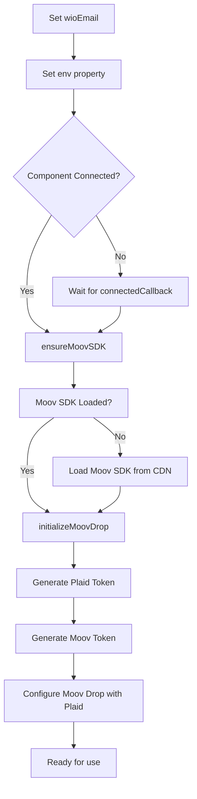
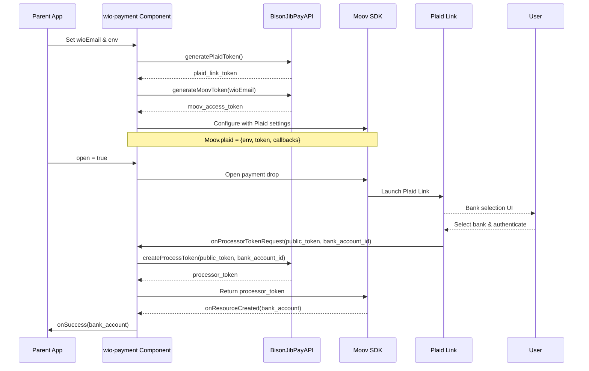

# WIO Payment Web Component Architecture

## Overview

The `wio-payment` web component enables Worker-Independent Operators (WIOs) to link their bank accounts securely through Moov and Plaid integration. It follows the same architectural pattern as [`operator-payment.js`](operator-payment.js:1) but includes Plaid Link for bank account verification.

## Component Name
`<wio-payment>`

---

## Exposed Properties

### Required Properties

| Property | Type | Description | Example |
|----------|------|-------------|---------|
| `wioEmail` | `string` | WIO's email address (used as Moov accountID) | `"wio@example.com"` |
| `env` | `string` | Plaid environment setting (`"sandbox"`, `"development"`, or `"production"`) | `"sandbox"` |

### Optional Properties

| Property | Type | Default | Description |
|----------|------|---------|-------------|
| `apiBaseURL` | `string` | `"https://bison-jib-development.azurewebsites.net"` | Backend API base URL |
| `embeddableKey` | `string` | (development key) | API authentication key |
| `redirectURL` | `string` | `window.location.origin` | Plaid redirect URL after OAuth flow |
| `open` | `boolean` | `false` | Controls Moov drop visibility |
| `onSuccess` | `Function` | `null` | Callback when bank account is successfully linked |
| `onError` | `Function` | `null` | Callback when an error occurs |

### Property Details

#### `env` (Required)
This property is injected into the Plaid configuration within the Moov integration. It determines which Plaid environment to use:
- `"sandbox"` - For development/testing with test credentials
- `"development"` - For development with real credentials but test mode
- `"production"` - For production use with real bank accounts

**Usage:**
```javascript
const payment = document.getElementById('payment');
payment.env = 'sandbox';
```

#### `wioEmail` (Required)
Similar to `operatorEmail` in [`operator-payment.js`](operator-payment.js:83), this identifies the WIO account in Moov. It's used for:
- Generating Moov access tokens
- Setting the `accountID` on the Moov drop
- Backend API requests

**Usage:**
```javascript
payment.wioEmail = 'wio@example.com';
```

#### `redirectURL` (Optional)
The URL where Plaid will redirect after OAuth completion. Defaults to the current origin.

**Usage:**
```javascript
payment.redirectURL = 'https://myapp.com/payment-callback';
```

---

## Component Lifecycle

### Initialization Flow



### Plaid Integration Flow



---

## Required API Methods

The following methods need to be added to the [`BisonJibPayAPI`](api.js:25) class:

### 1. `generatePlaidToken(wioEmail)`

Generates a Plaid Link token for the WIO.

**Endpoint:** `POST /api/embeddable/plaid/generate-token`

**Request:**
```json
{
  "wioEmail": "wio@example.com"
}
```

**Response:**
```json
{
  "link_token": "link-sandbox-abc123...",
  "expiration": "2024-01-15T10:30:00Z"
}
```

**Implementation:**
```javascript
async generatePlaidToken(wioEmail) {
  return this.request("/api/embeddable/plaid/generate-token", {
    method: "POST",
    body: JSON.stringify({ wioEmail }),
  });
}
```

### 2. `createProcessorToken(publicToken, bankAccountId)`

Exchanges Plaid public token for a processor token.

**Endpoint:** `POST /api/embeddable/plaid/create-processor-token`

**Request:**
```json
{
  "public_token": "public-sandbox-xyz789...",
  "bank_account_id": "account-id-123"
}
```

**Response:**
```json
{
  "processor_token": "processor-sandbox-abc123...",
  "bank_account_id": "account-id-123"
}
```

**Implementation:**
```javascript
async createProcessorToken(publicToken, bankAccountId) {
  return this.request("/api/embeddable/plaid/create-processor-token", {
    method: "POST",
    body: JSON.stringify({
      public_token: publicToken,
      bank_account_id: bankAccountId,
    }),
  });
}
```

### 3. `generateMoovToken(wioEmail)` - Already exists

This method already exists in [`api.js`](api.js:111) as `generateMoovToken(operatorEmail)`. It will be used with `wioEmail` instead.

---

## Moov Configuration with Plaid

The component configures the Moov payment-methods drop with Plaid integration:

```javascript
moovRef.plaid = {
  env: this.env,                          // From property
  redirectURL: this.redirectURL,          // From property or default
  token: plaidLinkToken,                  // From generatePlaidToken()
  onSuccess: this.handlePlaidSuccess,     // Internal handler
  onExit: this.handlePlaidExit,           // Internal handler
  onLoad: this.handlePlaidLoad,           // Internal handler
  onProcessorTokenRequest: async (public_token, bank_account_id) => {
    const result = await this.api.createProcessorToken(
      public_token,
      bank_account_id
    );
    return result.processor_token;
  }
};

moovRef.token = moovAccessToken;          // From generateMoovToken()
moovRef.accountID = this.wioEmail;        // From property
moovRef.paymentMethodTypes = ["bankAccount"];
moovRef.showLogo = true;
```

---

## Component State Management

Similar to [`operator-payment.js`](operator-payment.js:52), the component maintains internal state:

```javascript
this._state = {
  wioEmail: null,
  env: 'sandbox',
  redirectURL: window.location.origin,
  moovToken: null,
  plaidToken: null,
  isInitialized: false,
  isLoading: false,
  error: null,
};
```

---

## Error Handling

The component handles errors from multiple sources:

### Error Types

| Error Type | Source | Description |
|------------|--------|-------------|
| `sdk` | Moov SDK loading | Failed to load Moov SDK |
| `token` | API call | Failed to generate Moov or Plaid token |
| `plaid` | Plaid Link | User exited Plaid flow or Plaid error |
| `moov` | Moov drop | Moov payment drop error |
| `initialization` | Component | Missing required properties |

### Error Callback

```javascript
payment.onError = ({ errorType, error }) => {
  console.error(`Error (${errorType}):`, error);
  // Handle error in parent app
};
```

---

## Usage Example

### Basic Usage

```html
<!DOCTYPE html>
<html>
<head>
  <script src="component.js" type="module"></script>
  <script src="wio-payment.js"></script>
</head>
<body>
  <wio-payment id="payment"></wio-payment>

  <script>
    const payment = document.getElementById('payment');
    
    // Required properties
    payment.wioEmail = 'wio@example.com';
    payment.env = 'sandbox';
    
    // Optional callbacks
    payment.onSuccess = (bankAccount) => {
      console.log('Bank account linked:', bankAccount);
    };
    
    payment.onError = ({ errorType, error }) => {
      console.error('Payment error:', errorType, error);
    };
    
    // Open the payment drop
    payment.open = true;
  </script>
</body>
</html>
```

### With Custom Configuration

```javascript
const payment = document.getElementById('payment');

// Custom API configuration
payment.apiBaseURL = 'https://api.example.com';
payment.embeddableKey = 'your-key-here';

// Plaid configuration
payment.env = 'production';
payment.redirectURL = 'https://myapp.com/payment-success';

// WIO identification
payment.wioEmail = 'wio@example.com';

// Callbacks
payment.onSuccess = (bankAccount) => {
  // Update UI, store account info, etc.
};

payment.onError = ({ errorType, error }) => {
  // Show error message to user
};

// Open when ready
payment.open = true;
```

---

## Key Differences from operator-payment

| Feature | operator-payment | wio-payment |
|---------|-----------------|-------------|
| **Primary Property** | `operatorEmail` | `wioEmail` |
| **Plaid Integration** | ❌ None | ✅ Required |
| **Environment Property** | ❌ Not needed | ✅ `env` property for Plaid |
| **Token Generation** | 1 token (Moov) | 2 tokens (Moov + Plaid) |
| **Redirect URL** | ❌ Not applicable | ✅ Configurable for Plaid OAuth |
| **Processor Token** | ❌ Not needed | ✅ Required for Plaid → Moov |
| **API Methods Used** | `generateMoovToken()` | `generateMoovToken()`, `generatePlaidToken()`, `createProcessorToken()` |

---

## Implementation Checklist

- [ ] Create `wio-payment.js` file
- [ ] Extend `BisonJibPayAPI` class with Plaid methods
- [ ] Implement property getters/setters for `wioEmail`, `env`, `redirectURL`
- [ ] Implement Moov SDK loading (reuse from operator-payment)
- [ ] Implement dual token generation (Moov + Plaid)
- [ ] Configure Moov drop with Plaid settings
- [ ] Implement Plaid callback handlers
- [ ] Implement error handling for Plaid-specific errors
- [ ] Add comprehensive JSDoc documentation
- [ ] Update `component.js` to include wio-payment
- [ ] Create usage examples
- [ ] Test with sandbox Plaid credentials

---

## Testing Considerations

1. **Plaid Sandbox Testing**
   - Use sandbox credentials for testing
   - Test various bank selection scenarios
   - Test Plaid error flows (user exit, network errors)

2. **Token Generation**
   - Verify both Moov and Plaid tokens are generated
   - Test token expiration handling
   - Test token generation failures

3. **Processor Token Exchange**
   - Test successful token exchange
   - Test failed exchanges
   - Verify correct processor token returned to Moov

4. **Environment Switching**
   - Test all three environments (sandbox, development, production)
   - Verify correct Plaid configuration for each

---

## Security Considerations

1. **Token Handling**
   - Tokens stored only in component state (not exposed)
   - Tokens not persisted to localStorage
   - Tokens cleared on component disconnect

2. **Embeddable Key**
   - Key should be configurable (not hardcoded in production)
   - Key included in API requests securely

3. **Plaid Security**
   - Redirect URL should be validated server-side
   - Public tokens should be exchanged immediately
   - Processor tokens should be used once

---

## Future Enhancements

1. **Loading States** - Visual feedback during token generation
2. **Retry Logic** - Automatic retry for failed API calls
3. **Token Refresh** - Handle token expiration gracefully
4. **Custom Styling** - Allow parent app to style the component
5. **Events** - Emit custom events for all state changes
6. **Accessibility** - ARIA labels and keyboard navigation